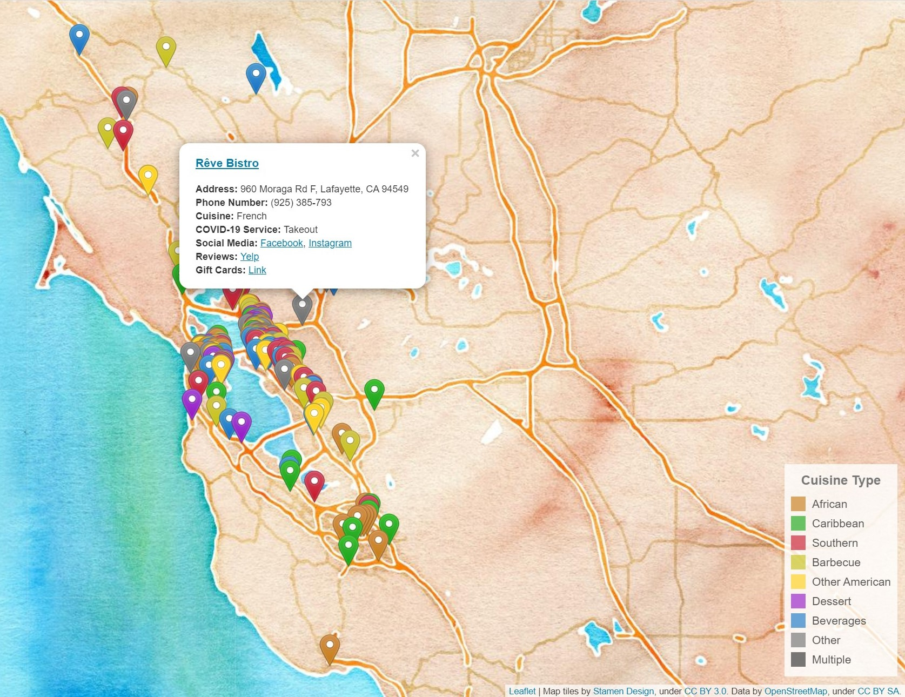

# [Black-Owned Bay Area Restaurants](https://vyoma-raman.github.io/BlackOwnedBayAreaRestaurants/)

### Data Source
[Directory](https://docs.google.com/spreadsheets/d/1mTthE5lwqVnTCIm3iQtQXLyxwK-pc17cuCp--BhAYX8/edit#gid=0) of Black-owned Bay Area restaurants, pop-ups and caterers compiled by San Francisco Chronicle restaurant critic [Soleil Ho](https://twitter.com/hooleil) and maintained alongside [Tracey Friley](https://www.instagram.com/bestfoodinoakland/), Jen Y., Sophi H., Rose E. and others.  
*Notes:*
- Only showing the businesses whose locations could be identified
- Supplemented with business address, Facebook link, and Yelp link for businesses for whom they could be identified
- If any data is incorrect, please let me know at *vyoma.raman@berkeley.edu*! Thank you for your help

### Other Sources
*Data:*
- Addresses: Google; Yelp; Facebook
- Latitude and longitude: [https://getlatlong.net/](https://getlatlong.net/); [https://www.latlong.net](https://www.latlong.net/convert-address-to-lat-long.html); [Google Maps](https://www.google.com/maps)
- Converted CSV file of data to GeoJSON using [online converter](https://www.convertcsv.com/csv-to-geojson.htm)

*Code:*
- Colored markers: [pointhi](https://github.com/pointhi/leaflet-color-markers) on Github
- Legend: [@haakseth](https://codepen.io/haakseth/pen/KQbjdO) on CodePen

### To Do
Filtering restaurants by region of the Bay, cuisine, and service type.  
The existing layers control is not ideal for this map's purposes, and I have not been able to find a package that is. Therefore, this project is on hiatus as-is until I am able to implement one myself.
